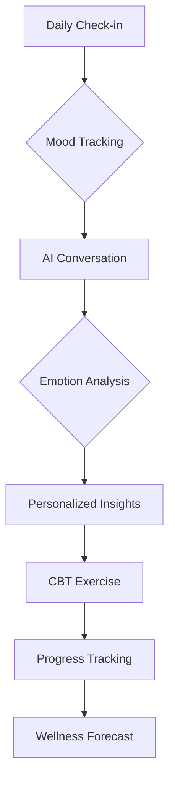

# 🚀 Neeva AI: Revolutionizing Mental Health with AI

[](https://github.com/DataScyther/Neeva-AI/releases)
[](https://opensource.org/licenses/MIT)
[](http://makeapullrequest.com)
[](https://nodejs.org/)
[](https://reactjs.org/)
[](https://www.typescriptlang.org/)
[](https://vitejs.dev/)

---

## Vision

> *"Empowering minds through AI-driven mental wellness – where technology meets compassion."*

Neeva AI represents the future of mental health support, seamlessly blending cutting-edge artificial intelligence with evidence-based therapeutic practices. Designed for proactive emotional maintenance and intelligent crisis intervention, our platform transforms how individuals engage with their mental well-being.

---

## Table of Contents

- Vision
- Core Features
- Technology Stack
- Quick Start
- Usage Guide
- Development
- Contributing
- License
- Support

---

## Core Features

| Feature | Description | Impact |
|---------|-------------|---------|
| 🤖 **AI Mental Health Companion** | Natural language conversations with an empathetic AI therapist | 24/7 personalized emotional support |
| 📊 **Advanced Mood Analytics** | AI-powered pattern recognition and predictive insights | Proactive mental health management |
| 🧠 **Intelligent CBT Engine** | Adaptive cognitive behavioral therapy exercises | Scientifically-backed therapeutic interventions |
| 👥 **Community Intelligence** | Anonymous peer support with AI-moderated discussions | Safe, meaningful social connections |
| 🚨 **Crisis Detection System** | Real-time emergency response with professional escalation | Life-saving crisis intervention |
| 📈 **Predictive Dashboard** | Machine learning-driven wellness forecasting | Preventative mental health care |
| 🧘 **AI-Guided Meditation** | Personalized mindfulness sessions with biofeedback | Enhanced stress reduction and relaxation |
| 🔒 **Quantum-Safe Security** | Military-grade encryption with zero-knowledge architecture | Uncompromised privacy protection |

---

## 🛠 Technology Stack

### Frontend Architecture

- **⚡ Vite 6.0** - Lightning-fast build tool and dev server
- **⚛️ React 18** - Modern component-based UI framework
- **🔷 TypeScript 5.0** - Type-safe JavaScript for robust development
- **🎨 Tailwind CSS** - Utility-first CSS framework for rapid styling
- **🎭 Radix UI** - Accessible, unstyled UI primitives
- **✨ Shadcn/ui** - Beautiful, customizable component library

### AI & Backend Infrastructure

- **🧠 OpenRouter API** - Unified access to cutting-edge language models
- **🌟 Google Gemini** - Advanced multimodal AI capabilities
- **🗄️ Supabase** - Real-time database with built-in authentication
- **🚀 Node.js** - High-performance backend runtime
- **🐘 PostgreSQL** - Advanced relational database management

### Cross-Platform Deployment

- **📱 Capacitor** - Native mobile app development
- **☁️ Netlify** - Global CDN with automated deployments
- **🔄 CI/CD** - Automated testing and deployment pipelines

---

## 🚀 Quick Start

### Prerequisites

- **Node.js** 18+ ([Download](https://nodejs.org/))
- **npm** or **pnpm** (recommended for speed)
- **Git** for version control

### Installation

1. **Clone the Repository**

   ```bash
   git clone https://github.com/DataScyther/Neeva-AI.git
   cd Neeva-AI
   ```

2. **Install Dependencies**

   ```bash
   npm install
   # or for faster installs
   pnpm install
   ```

3. **Environment Setup**

   ```bash
   cp .env.example .env
   # Edit .env with your API keys
   ```

4. **Launch Development Server**

   ```bash
   npm run dev
   ```

5. **Access the Application**

   - Open [http://localhost:5173](http://localhost:5173) in your browser
   - Experience the future of mental health technology!

---

## 📖 Usage Guide

### First-Time Setup

1. **Complete Onboarding** - Personalized mental health assessment
2. **Configure Preferences** - Customize your wellness journey
3. **Grant Permissions** - Enable notifications and data access

### Daily Workflow



### Key Interactions

- **💬 Chat Interface**: Natural conversations with Neeva AI
- **❤️ Mood Logging**: Quick emotional state recording
- **📈 Dashboard**: Visual analytics and trend analysis
- **🎯 Exercises**: Guided therapeutic activities
- **👥 Community**: Anonymous peer support groups

---

## 🔧 Development

### Project Structure

```text
Neeva-AI/
├── src/
│   ├── components/     # React components
│   ├── hooks/         # Custom React hooks
│   ├── lib/           # Utility libraries
│   ├── utils/         # Helper functions
│   └── supabase/      # Database integration
├── backend/           # Node.js API server
├── android/           # Native Android app
├── docs/             # Documentation
└── public/           # Static assets
```

### Available Scripts

```bash
npm run dev          # Start development server
npm run build        # Build for production
npm run preview      # Preview production build
npm run deploy:netlify # Deploy to Netlify
```

### Environment Variables

```env
VITE_OPENROUTER_API_KEY=your_openrouter_key
VITE_GEMINI_API_KEY=your_gemini_key
VITE_SUPABASE_URL=your_supabase_url
VITE_SUPABASE_ANON_KEY=your_supabase_key
```

---

## Contributing

We welcome contributions from developers, mental health professionals, and AI researchers!

### How to Contribute

1. **Fork** the repository
2. **Create** a feature branch: `git checkout -b feature/amazing-feature`
3. **Commit** your changes: `git commit -m 'Add amazing feature'`
4. **Push** to the branch: `git push origin feature/amazing-feature`
5. **Open** a Pull Request

### Development Guidelines

- 🔒 **Security First**: All contributions undergo security review
- 🧪 **Testing**: Write tests for new features
- 📚 **Documentation**: Update docs for API changes
- 🎨 **UI/UX**: Follow design system guidelines
- 🚀 **Performance**: Optimize for speed and accessibility

---

## 📄 License

**MIT License** - Open source and free to use, modify, and distribute.

```text
Copyright (c) 2025 DataScyther

Permission is hereby granted, free of charge, to any person obtaining a copy
of this software and associated documentation files (the "Software"), to deal
in the Software without restriction, including without limitation the rights
to use, copy, modify, merge, publish, distribute, sublicense, and/or sell
copies of the Software...
```

---

## Support & Community

### Get Help

- 🐛 **Bug Reports**: [GitHub Issues](https://github.com/DataScyther/Neeva-AI/issues)
- 💡 **Feature Requests**: [GitHub Discussions](https://github.com/DataScyther/Neeva-AI/discussions)
- 💬 **Community Chat**: Join our Discord server
- 📧 **Professional Support**: [support@neeva-ai.com](mailto:support@neeva-ai.com)

### Crisis Resources

If you're experiencing a mental health crisis:

- 🇮🇳 **India**: Call 9152987821 (AASRA)
- 🌍 **International**: Contact local emergency services
- 🚨 **Neeva Crisis Mode**: Available 24/7 within the app

---

## 🙏 Acknowledgments

Built with ❤️ by passionate developers, mental health advocates, and AI researchers committed to making mental wellness accessible to everyone.

"Technology should serve humanity's deepest needs – emotional well-being is fundamental."

---

Experience the future of mental health care. Download Neeva AI today and start your journey toward better mental wellness. 🌟
