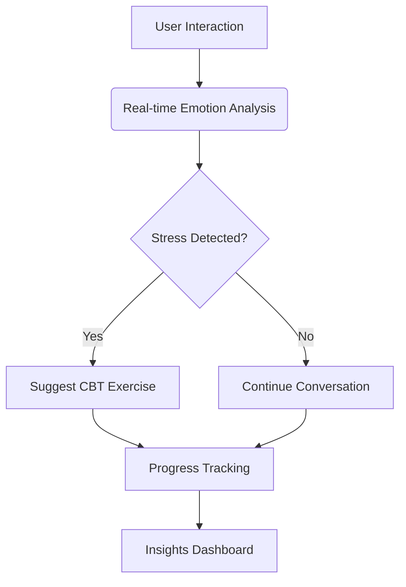

<!-- Dynamic Banner Section -->
<div align="center">
  
</div>

<h1 align="center">
  
  <br>Neeva AI: Next-Generation Mental Wellness Platform<br>
</h1>

<div align="center">
  <!-- Badges -->
  [](https://github.com/DataScyther/Neeva-AI/releases)
  [](https://opensource.org/licenses/MIT)
  [](https://github.com/DataScyther/Neeva-AI/graphs/contributors)
</div>

---

## 🌟 Project Overview

Neeva AI is an AI-powered mental health platform combining **clinical expertise** with **cutting-edge technology** to deliver personalized emotional support. Built with:

<p align="center">
  
</p>

**Key Features**:
| Feature | Description | Technology Used |
|---------|-------------|-----------------|
| 🧠 AI Companion | Context-aware conversations with emotional analysis | OpenAI GPT-4 + Custom NLP Models |
| 📈 Mood Analytics | Interactive visualizations of emotional patterns | Recharts + D3.js |
| 🛡️ Privacy First | End-to-end encrypted data storage | AES-256 + JWT |
| 🧘 CBT Exercises | 50+ evidence-based therapy modules | Clinical Psychology Framework |

**Unique Value Proposition**:


---

## 🛠 Installation Guide

### Prerequisites
- Node.js ≥18.x
- PostgreSQL ≥14
- OpenRouter API Key

### Platform-Agnostic Setup

```bash
# 1. Clone repository
git clone https://github.com/DataScyther/Neeva-AI.git && cd Neeva-AI

# 2. Install dependencies
npm install --legacy-peer-deps

# 3. Configure environment
cp .env.example .env
# Edit .env with your credentials

# 4. Database setup
npm run db:migrate

# 5. Start development server
npm run dev
```

**Platform-Specific Notes**:
- **Windows**: Enable WSL2 for optimal performance
- **macOS**: Install Xcode Command Line Tools if missing
- **Linux**: Ensure libvips is installed (`sudo apt install libvips-dev`)

---

## 💡 Usage Examples

### 1. AI Conversation Interface
```tsx
// components/AIChat.tsx
import { useAIChat } from '../hooks/useAIChat';

export const AIChat = () => {
  const { messages, sendMessage } = useAIChat();
  
  return (
    <div className="chat-container bg-gray-50 p-4 rounded-lg">
      {messages.map((msg) => (
        <div key={msg.id} className={`message ${msg.role}`}>
          {msg.content}
        </div>
      ))}
      <input 
        className="chat-input"
        onKeyPress={(e) => {
          if (e.key === 'Enter') sendMessage(e.currentTarget.value);
        }}
      />
    </div>
  );
};
```

### 2. Mood Tracking Workflow
```bash
curl -X POST https://api.neeva-ai.com/v1/mood \
  -H "Authorization: Bearer $TOKEN" \
  -d '{
    "mood_score": 7.5,
    "tags": ["work", "family"],
    "journal_entry": "Feeling optimistic about new project"
  }'
```

---

## 🤝 Contributing Guidelines

We welcome contributions through:

1. **Code Contributions**:
   - Branch naming: `feat/[feature-name]` or `fix/[issue-number]`
   - Commit message format: `<type>(<scope>): <description>`
   
   ```bash
   # Example commit
   git commit -m "feat(auth): add OAuth2 integration"
   ```

2. **Issue Reporting**:
   - Use our [Issue Template](.github/ISSUE_TEMPLATE.md)
   - Include reproduction steps and environment details

3. **Code Standards**:
   - 100% TypeScript coverage
   - ESLint + Prettier enforced
   - 80%+ test coverage for new features

---

## 📬 Contact & Support

<div align="center">
  <a href="mailto:support@neeva-ai.com">
    
  </a>
  <a href="https://linkedin.com/in/your-profile">
    
  </a>
  <a href="https://discord.gg/your-invite">
    
  </a>
</div>

---

<div align="center" style="margin-top: 40px">
  <em>"Empowering mental wellness through ethical AI"</em> 🌱
</div>
